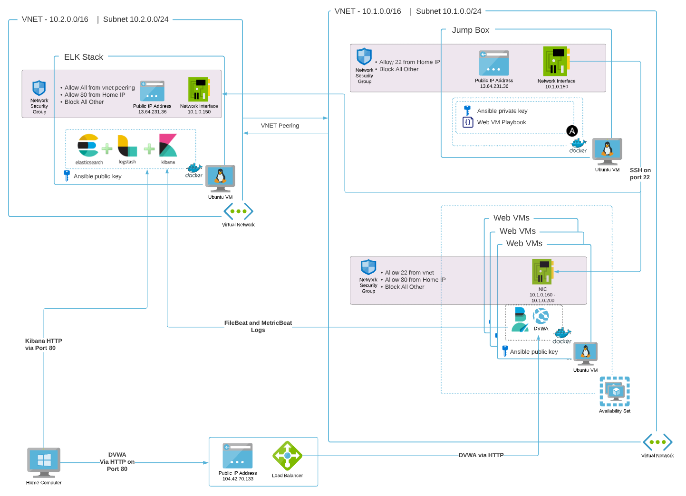
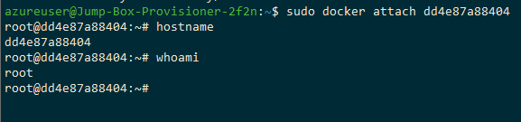
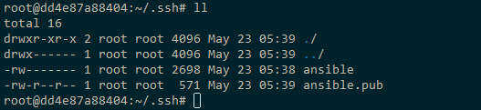

# Azure Security 

[TOC]


---


This mini project sets up an Azure environment containing:

* A vnet with a single subnet in
* A Ubuntu VM to be used as a jump box and running Ansible in a docker container
* n number of VMs running a Dam Vulnerable Web App (DVWA) in a docker container
* A Ubuntu VM running an ELK Stack for monitoring





## Keep track of key details


To help keep track of important detail you can use this table and fill in the values as you move through the steps

| Parameter             | Default Value                              | Your Value |
| --------------------- | ------------------------------------------ | ---------- |
| Jumpbox Public VM     | -                                          |            |
| Jumpbox Internal IP   | 10.1.0.150                                 |            |
| DVWA Load Balancer IP | -                                          |            |
| DVWA Internal IPs     | 10.1.0.160<br />10.1.0.170<br />10.1.0.180 |            |
| ELK VM Public IP      | -                                          |            |
| ELK VM Internal IP    | 10.2.0.100                                 |            |
|                       |                                            |            |
|                       |                                            |            |
|                       |                                            |            |


## Deploying the Azure Infrastructure 


It is recommended to deploy each section into their own resource groups but if you have a preference to install everything into the one resource group just select the same group when creating the deployment. 

Ideally a resource group should only contain resources that have the same life span.  For example you wouldn't want to put VMs and a VNET in the same resource group as its likely that the VMs will be deleted long before the VNET and its a lot easier to delete an entire RG containing the VM rather than filtering out all the independent resources for a particular VM from a RG contain lots of other resources. 


### Creating the VNET


[](https://portal.azure.com/#create/Microsoft.Template/uri/https%3A%2F%2Fraw.githubusercontent.com%2Fiferguson%2Fcode-snippets%2Fmain%2Fcloud-security%2Farm%2Fvnet.json)

| Parameter                         | Description                                                  |
| --------------------------------- | ------------------------------------------------------------ |
| Region                            | Select from the dropdown which Azure region to create the Resource Group in. |
| Deploy Region Web                 | Enter the region the VNET for the Web servers and Jump box will be deployed to.  <br />Leave as the default `[resourceGroup().location]` to use the same region as the resource group.<br />**Note**: VMs must be deployed to the same region as the VNET |
| Deploy Region ElK                 | Enter the region the VNET for the ELK server will be deployed to.<br />Leave as the default `[resourceGroup().location]` to use the same region as the resource group.<br />**Note**: VMs must be deployed to the same region as the VNET |
| Vnet Address Space Web            | Default:  `10.1.0.0/16`<br />It is recommended not to change this as some static IPs will be set later within this range.  If you want to change this CIDR then you will also need to update the DVWA ARM template |
| Subnet Default Address Prefix Web | Default: `10.1.0.0/24`                                       |
| Vnet Address Space Elk            | Default:  `10.2.0.0/16`                                      |
| Subnet Default Address Prefix Elk | Default: `10.2.0.0/24`                                       |
| Vnet Name Web                     | Default: `vn-01`                                             |
| Vnet Name Elk                     | Default: `vn-02`                                             |
| Environment                       | Creates an `env` tag for each resource with this value       |


### Creating the Jumpbox VM

[](https://portal.azure.com/#create/Microsoft.Template/uri/https%3A%2F%2Fraw.githubusercontent.com%2Fiferguson%2Fcode-snippets%2Fmain%2Fcloud-security%2Farm%2Fjumpbox.json)

| Parameter          | Description                                                  |
| ------------------ | ------------------------------------------------------------ |
| Region             | Select from the dropdown which Azure region to create the Resource Group in. |
| Vm User Name       | Select a username to be used for the main account on the Jumpbox VM<br />Default: `azureuser` |
| Jump Box Vm Name   | Select a name for the VM.  By default the VM will be called `Jump-Box-Provisioner-` followed by a 4 character unique string of the RG name |
| Deploy Region      | Enter the region the VNET for the Web servers and Jump box will be deployed to.  <br />Leave as the default `[resourceGroup().location]` to use the same region as the resource group.<br />**Note**: VMs must be deployed to the same region as the Web VNET |
| Jump Box Vm Size   | Select the Size of the VM                                    |
| Jump Box Static IP | Assign an internal static IP for the VM.  This **MUST** be within the subnet range you selected when creating the VNETs |
| Vnet Name Web      | Enter the Name of the Web VNET you created in the previous step |
| Vnet Web Rg        | Enter the RG Name the VNETs were deployed to in the previous step |
| Ssh Public Key     | Enter the SSH Public Key you will be using to connect to this VM |
| Home IP            | Enter your [home IP](https://www.google.com/search?q=what+is+my+ip&oq=what+is+my+ip).  Only traffic from this IP address will be allowed to connect to the Jumpbox VM |
| Environment        | Creates an `env` tag for each resource with this value       |


### Creating the DVWAs VMs

[](https://portal.azure.com/#create/Microsoft.Template/uri/https%3A%2F%2Fraw.githubusercontent.com%2Fiferguson%2Fcode-snippets%2Fmain%2Fcloud-security%2Farm%2Fdvwa.json)

| Parameter              | Description                                                  |
| ---------------------- | ------------------------------------------------------------ |
| Region                 | Select from the dropdown which Azure region to create the Resource Group in. |
| Vm User Name           | Select a username to be used for the main account on the Jumpbox VM<br />Default: `azureuser` |
| Web Vm Name            | Select a name for the VM.  By default the VM will be called `Web-` followed by the number of the VM (1-10) |
| Deploy Region          | Enter the region the VNET for the Web servers and Jump box will be deployed to.  <br />Leave as the default `[resourceGroup().location]` to use the same region as the resource group.<br />**Note**: VMs must be deployed to the same region as the Web VNET |
| Jump Box Vm Size       | Select the Size of the VM                                    |
| Jump Box Static IP     | This **MUST** be the same static IP address set for the Jumpbox in the last step.  Only SSH traffic from this IP address will be allowed to the DVWA VMs |
| Number Of Web Vms      | How many VMs will be rolled out (between 1 to 10).<br />**Note**: Ansible will need to know the IPs of the VMs deployed here so the following static IPs will be used in order:<br /><br />"10.1.0.160",<br/>"10.1.0.170",<br/>"10.1.0.180",<br/>"10.1.0.190",<br/>"10.1.0.191",<br/>"10.1.0.192",<br/>"10.1.0.193",<br/>"10.1.0.194",<br/>"10.1.0.195",<br/>"10.1.0.196" |
| Vnet Name Web          | Enter the Name of the Web VNET you created two steps ago     |
| Vnet Web Rg            | Enter the RG Name the VNETs were deployed two steps ago      |
| Ssh Public Key Ansible | Enter the public SSH key ansible will use to connect to all the VMs |
| Home IP                | Enter your [home IP](https://www.google.com/search?q=what+is+my+ip&oq=what+is+my+ip).  Only web traffic from this IP address will be allowed to connect to the DVWA VMs |
| Environment            | Creates an `env` tag for each resource with this value       |


### Creating the ELK Stack VMs

[](https://portal.azure.com/#create/Microsoft.Template/uri/https%3A%2F%2Fraw.githubusercontent.com%2Fiferguson%2Fcode-snippets%2Fmain%2Fcloud-security%2Farm%2Felk.json)

| Parameter              | Description                                                  |
| ---------------------- | ------------------------------------------------------------ |
| Region                 | Select from the dropdown which Azure region to create the Resource Group in. |
| Vm User Name           | Select a username to be used for the main account on the Jumpbox VM<br />Default: `azureuser` |
| Elk Box Vm Name        | Select a name for the ELK VM.  By default the VM will be called `vm-elk-` followed by a 4 character unique string of the RG name |
| Deploy Region          | Enter the region the VNET for the Web servers and Jump box will be deployed to.  <br />Leave as the default `[resourceGroup().location]` to use the same region as the resource group.<br />**Note**: VMs must be deployed to the same region as the Web VNET |
| Jump Box Vm Size       | Select the Size of the VM                                    |
| Elk Box Static IP      | Select a static IP for the VM.  <br />**Note:** This must be in the same subnet range as specific in the first step when setting up the ELK VNET |
| Jump Box Static IP     | Enter the IP Address for the Jumpbox created a couple of steps ago.  Only SSH traffic from this IP will be allowed to the ELK VM. |
| Ssh Public Key Ansible | Enter the public SSH key ansible will use to connect to all the VMs |
| Home IP                | Enter your [home IP](https://www.google.com/search?q=what+is+my+ip&oq=what+is+my+ip).  Only web traffic from this IP address will be allowed to connect to the DVWA VMs |
| Vne Elk Rg             | The name of the Resource Group containing the ELK VNET       |
| Vnet Name Elk          | The name of the ELK VNET                                     |
| Environment            | Creates an `env` tag for each resource with this value       |


## Setting up Ansible on the JumpBox

#### Setting up Docker and Ansible Container

Next we want to setup Ansible in a docker container on the Jumpbox.  This will be used to configure all the other DVWA and ELK VMs

First up lets get everything on the VM updated

``` bash
sudo apt-get update
sudo apt-get upgrade
```


Next install Docker

``` bash
sudo apt install docker.io
```


And then pull down and run the ansible docker container

``` bash
sudo docker pull cyberxsecurity/ansible
sudo docker run -ti cyberxsecurity/ansible:latest bash

# Also a good idea to set the Ansible Docker container to start up whenever the VM does
# run this when you exit the docker container
sudo docker update --restart unless-stopped [ansible container id ]

# Now when you need to access the ansible container you can just attach to the already running instance
sudo docker attach [ansible container id ]
```


You should now find yourself in the ansible Docker container.  running a couple of `hostname` and `whoami` checks will confirm this. 




#### Setup the ansible Private SSH Key

``` bash
mkdir ~/.ssh
cd ~/.ssh

# Copy in the public and private ssh keys you are using for ansible or using ssh-keygen create some new ones.
# NOTE: If you create new ones you will need to go back and update the pubic ssh keys on all the DVWA and ELK VMs

# Make sure the correct permissions are set on the private key
chmod 600 ansible
```


When done it should look like this:




#### Configure Ansible

* Update the Ansible config file.
  `vi /etc/ansible/ansible.cfg`
* Locate the line starting `remote_user = root` and replace `root` with the VM User Name you specified when setting up the VMs in Azure
* Save and close the file


* Update the hosts file
  `vi /etc/ansible/hosts`
* Add in the IP addresses for the Webservers and ELK server. 
* Enforce the python interpreter to use Python3 
  `ansible_python_interpreter=/usr/bin/python3`
* set the SSH Private key being used
  `ansible_ssh_private_key_file=~/.ssh/ansible`
* When done it will look something like this:
  


## Ansible Scripts for configuring the VMS

Run the following to download the Ansible playbooks and unpack them into the `/etc/ansible` folder

```bash
cd /etc/ansible && curl -L -o ansible-roles.tar.gz https://github.com/iferguson/code-snippets/raw/cloud-security/cloud-security/resources/ansible-roles.tar.gz && tar -zxf ansible-roles.tar.gz
```


### ELK

To run the ansible role for ELK Server

``` bash
cd /etc/ansible && ansible-playbook elk.yml
```

_Note: This must be run before running the DVWA role as the filebeat and metricbeat installs need to talk back to the Elastic sea_

### DVWA

To run the ansible role for DVWA 

``` bash
cd /etc/ansible && ansible-playbook dvwa.yml
```


### All Servers

To run the ansible role for all Servers the site.yml playbook is configured to run both the DVWA and ELK playbooks

``` bash
cd /etc/ansible && ansible-playbook elk.yml
```

